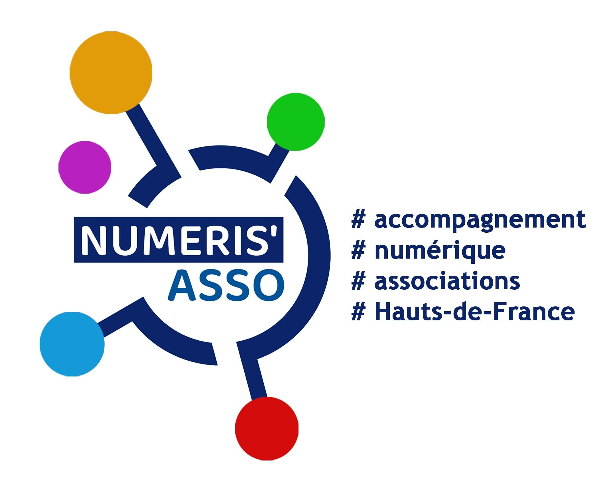
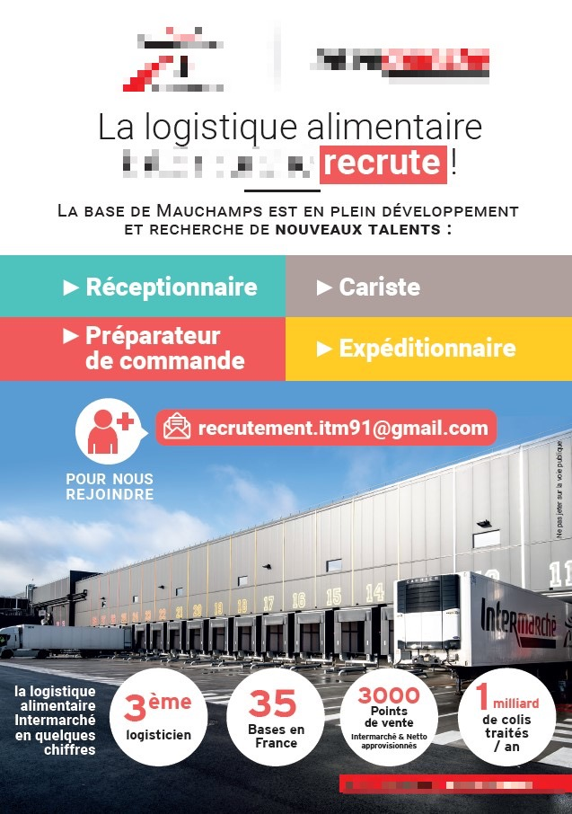

---
# try also 'default' to start simple
theme: seriph
# random image from a curated Unsplash collection by Anthony
# like them? see https://unsplash.com/collections/94734566/slidev
background: https://images.unsplash.com/photo-1582970816926-c8b60f417661?ixlib=rb-4.0.3&ixid=MnwxMjA3fDB8MHxwaG90by1wYWdlfHx8fGVufDB8fHx8&auto=format&fit=crop&w=1170&q=80
# apply any windi css classes to the current slide
class: 'text-center'
# https://sli.dev/custom/highlighters.html
highlighter: shiki
# show line numbers in code blocks
lineNumbers: false
# some information about the slides, markdown enabled
info: |
  ## Slidev Starter Template
  Presentation slides for developers.

  Learn more at [Sli.dev](https://sli.dev)
# persist drawings in exports and build
drawings:
  persist: false
# page transition
transition: slide-left
# use UnoCSS
css: unocss
---

# Le Logiciel Libre pour la protection des données personnelles

<center>
Quel impact de l'#OpenSource en matière de #Cybersécurité<br>
et particulièrement sur la protection des données personnelles?
</center>

<div class="pt-12">
  <span @click="$slidev.nav.next" class="px-2 py-1 rounded cursor-pointer" hover="bg-white bg-opacity-10">
    Prêt ?  <carbon:arrow-right class="inline"/>
  </span>
</div>

---
layout: center
---

# Remerciements

Pierrick TESTARD<br>
Coordinateur régional du projet Numéris’Asso

<center>


<br>

<br>


</center>

<style>
h1 {
  background-color: #2B90B6;
  background-image: linear-gradient(45deg, #4EC5D4 10%, #146b8c 20%);
  background-size: 100%;
  -webkit-background-clip: text;
  -moz-background-clip: text;
  -webkit-text-fill-color: transparent;
  -moz-text-fill-color: transparent;
}
</style>

<!--
Here is another comment.
-->

---
layout: image-right
image: ./assets/photo-MMM.jpeg
---

# Pour me présenter

Directeur Général de LINAGORA depuis 2000. Début de carrière au sein des Ministère des Armées.

- 🧑‍💻 **Open Source** - depuis 1991
- 📝 **Promotion et Vulgarisation** - fan d'écriture & de transmission du savoir
- 🤹 **Innovation** - pour la "Good Tech" 
- 🛠 **Geek for ever** - culture Maker & DIY
- 🏃‍♂️ **Trailer** - Pour s'évader et se reconnecter 

<br><br>
<mdi-linkedin />https://www.linkedin.com/in/mmaudet/<br>
<mdi-twitter />[@mmaudet](https://twitter.com/mmaudet)<br>
<mdi-email-fast /> mmaudet@linagora.com<br>

<style>
h1 {
  background-color: #2B90B6;
  background-image: linear-gradient(45deg, #4EC5D4 10%, #146b8c 20%);
  background-size: 100%;
  -webkit-background-clip: text;
  -moz-background-clip: text;
  -webkit-text-fill-color: transparent;
  -moz-text-fill-color: transparent;
}
</style>

<!--
Here is another comment.
-->

---
layout: center
---

<center>


</center>

---
layout: center
---



<arrow v-click="1" x1="750" y1="420" x2="600" y2="300" color="#564" width="3" arrowSize="1" />


---
layout: image-right
image: ./assets/spy-internet.jpg
---

# Des menaces réelles 

<br>
<v-click>

- Les courtiers en données : leur poids et leur propre sécurité !
  - Trop tard ? : [Have I been Pwned ?](https://haveibeenpwned.com/) 

</v-click>

<v-click>

- Internet à double vitesse : YouTube Premium

</v-click>

<v-click>

- La neutralité du Net : Verizon, Comcast...

</v-click>

<v-click>

- Espionnage : chinois avec TikTok, WhatsApp/Zoom pour les Etats-Unis

</v-click>

<v-click>

- Explicabilité des IA génératives à la ChatGPT

</v-click>

<br>
<br>

<v-click>

- **Quid de notre autonomie numérique ? 
#Biodiversite_Numerique #Souverainete**

</v-click>

<style>
h1 {
  background-color: #2B90B6;
  background-image: linear-gradient(45deg, #4EC5D4 10%, #146b8c 20%);
  background-size: 100%;
  -webkit-background-clip: text;
  -moz-background-clip: text;
  -webkit-text-fill-color: transparent;
  -moz-text-fill-color: transparent;
}
</style>


---

# Et quel futur pour nos enfants ?

<div grid="~ cols-2 gap-4">
<div>

<br>

- C'est déjà pas aisé pour les adultes...

<br>

- Les enfants n’ont pas forcément conscience de ce que cela peut impliquer de simplement donner sa véritable identité ou de partager une photo sur n’importe quel réseau social à la mode. 


<br>

- L'Education Nationale n'est pas suffisament formé et pour le moment le sujet n'est pas bien traité...

<br>

- **Tout faire pour les sensibiliser et leur donner les bons réflexes**

</div>

<div>

```html
<Tweet id="1633141953754742784" />
```

<Tweet id="1633141953754742784" scale="0.75" />

</div>
</div>

<style>
h1 {
  background-color: #2B90B6;
  background-image: linear-gradient(45deg, #4EC5D4 10%, #146b8c 20%);
  background-size: 100%;
  -webkit-background-clip: text;
  -moz-background-clip: text;
  -webkit-text-fill-color: transparent;
  -moz-text-fill-color: transparent;
}
</style>


<!--
Presenter note with **bold**, *italic*, and ~~striked~~ text.

Also, HTML elements are valid:
<div class="flex w-full">
  <span style="flex-grow: 1;">Left content</span>
  <span>Right content</span>
</div>
-->

---
layout: cover
---

### Comment peut-on (pouvez-vous) changer la situation ?

---
layout: default
---

# Au niveau citoyen : acquérir une hygiène numérique

- S'**informer et se former** : [MooC SecNumAcadémie de l'ANSSI](https://secnumacademie.gouv.fr/)
- **Utiliser des logiciels libres** pour les outils sensibles (navigateur, client de messagerie, visio conférence,...)
  - Firefox, Brave, Thunderbird, Jitsi
- **1 service = 1 mot de passe** + un coffre fort Open Source de gestion des secrets :
  - **KeyPass** qualifié par l'ANSSI
- Privilégier les **authentifications à multiple facteurs** et **utiliser un VPN**
- **Sensibiliser les enfants** et "contrôler" : sur les devices Androïd, l'application "Family Link" de Google 😟
- Faire le ménage et **nettoyer en profondeur**
- Faire des **sauvegardes "externalisées"** régulièrement

<br>

Pour commencer son traitement : [Cybermalveillance.gouv.fr](https://www.cybermalveillance.gouv.fr/bonnes-pratiques)

Pour aller plus loin : [Le site de la CNIL](https://www.cnil.fr/fr/maitriser-mes-donnees)

<style>
h1 {
  background-color: #2B90B6;
  background-image: linear-gradient(45deg, #4EC5D4 10%, #146b8c 20%);
  background-size: 100%;
  -webkit-background-clip: text;
  -moz-background-clip: text;
  -webkit-text-fill-color: transparent;
  -moz-text-fill-color: transparent;
}
</style>

---
layout: default
---

# Les associations du Libre


<center>


[April](https://www.april.org/)

  

[FramaSoft](https://framasoft.org/fr/)

  

[Socle Interministériel de logiciels libres](https://sill.etalab.gouv.fr/software)


[Adullact](https://www.adullact.org/)

</center>

<style>
h1 {
  background-color: #2B90B6;
  background-image: linear-gradient(45deg, #4EC5D4 10%, #146b8c 20%);
  background-size: 100%;
  -webkit-background-clip: text;
  -moz-background-clip: text;
  -webkit-text-fill-color: transparent;
  -moz-text-fill-color: transparent;
}
</style>

<!--
Here is another comment.
-->

---
layout: image-right
image: ./assets/RGPD.jpeg
---

# Au niveau politique : réguler et se faire confiance

- Une règlementation (trop) riche
  - Règlement Général sur la Protection des Données (RGPD) 
  - Digital Markets Act (DMA)
  - Digital Services Act (DSA)

- Le label SecNumCloud pour référencer les clouds de confiance

- **La nécessité d'avoir une DiNum forte avec une stratégie claire**

<br>


<style>
h1 {
  background-color: #2B90B6;
  background-image: linear-gradient(45deg, #4EC5D4 10%, #146b8c 20%);
  background-size: 100%;
  -webkit-background-clip: text;
  -moz-background-clip: text;
  -webkit-text-fill-color: transparent;
  -moz-text-fill-color: transparent;
}
</style>


---
layout: default
---

# Au niveau des Entreprises et des Administrations

- 75% des services SaaS utilisés en Europe, sont ceux des GAFAM 🤔
  - Le prix des solutions SaaS augmentent et globalement cela va continuer. +30% pour Office 365 en 2023 !

- **La Souveraineté à un coût mais elle est strictement nécessaire**
 - Le ministre des Armées, Sébastien Lecornu, a dévoilé le mercredi 22 février 2023 un plan d’actions pour "*accélérer les cadences de production d'armement et la relocalisation d’activités stratégiques : relocaliser, accélérer et augmenter.*"

- Un tel programme d'investissement est nécessaire pour créer **la 3ème Voie Numérique** et développer une **Infratech Souveraine** nécessaire à notre Autonomie Stratégique dans le domaine du numérique.


<br>

Pour commencer son traitement : [Cybermalveillance.gouv.fr](https://www.cybermalveillance.gouv.fr/bonnes-pratiques)

Pour aller plus loin : [Le site de la CNIL](https://www.cnil.fr/fr/maitriser-mes-donnees)

<style>
h1 {
  background-color: #2B90B6;
  background-image: linear-gradient(45deg, #4EC5D4 10%, #146b8c 20%);
  background-size: 100%;
  -webkit-background-clip: text;
  -moz-background-clip: text;
  -webkit-text-fill-color: transparent;
  -moz-text-fill-color: transparent;
}
</style>


---
layout: image-right
image: ./assets/libre-association.png
---

# Au niveau des projets associatifs

<br>
Le choix de logiciels libres répond aussi aux projets associatifs comme outil pédagogique et de sensibilisation sur la question de l’appropriation technologique et de la bonne hygiène numérique.

Il constitue de surcroît une offre mature pour soutenir votre projet associatif au quotidien :
- Galette : gestion des membres
- Grisbi : gestion des finances
- Dolibarr : Progiciel de Gestion Intégrée (PGI)

A découvrir ici [Guide Libre Association](http://guide.libreassociation.info/)


<style>
h1 {
  background-color: #2B90B6;
  background-image: linear-gradient(45deg, #4EC5D4 10%, #146b8c 20%);
  background-size: 100%;
  -webkit-background-clip: text;
  -moz-background-clip: text;
  -webkit-text-fill-color: transparent;
  -moz-text-fill-color: transparent;
}
</style>

---
layout: cover
---

## Notre propre action :

<br>

### “*Inventer et développer les Logiciels Libres et Open Source éthiques pour participer à changer le Monde en ayant un maximum d’impacts positifs pour l’homme, pour la société et pour la planète.*”
<br>

<center>  </center>

<br>


---
layout: center
---


---
layout: default
---


# L'alternative Open Source à Google et Microsoft existe

<br>


<br>
<br>

A découvrir sur le site de [Twake.app](https://twake.app/)

<style>
h1 {
  background-color: #2B90B6;
  background-image: linear-gradient(45deg, #4EC5D4 10%, #146b8c 20%);
  background-size: 100%;
  -webkit-background-clip: text;
  -moz-background-clip: text;
  -webkit-text-fill-color: transparent;
  -moz-text-fill-color: transparent;
}
</style>


---
layout: default
---

# Messagerie d'équipe

<br>

<center></center>


<style>
h1 {
  background-color: #2B90B6;
  background-image: linear-gradient(45deg, #4EC5D4 10%, #146b8c 20%);
  background-size: 100%;
  -webkit-background-clip: text;
  -moz-background-clip: text;
  -webkit-text-fill-color: transparent;
  -moz-text-fill-color: transparent;
}
</style>

---
layout: default
---

# Vidéo conférence

<center></center>

<style>
h1 {
  background-color: #2B90B6;
  background-image: linear-gradient(45deg, #4EC5D4 10%, #146b8c 20%);
  background-size: 100%;
  -webkit-background-clip: text;
  -moz-background-clip: text;
  -webkit-text-fill-color: transparent;
  -moz-text-fill-color: transparent;
}
</style>

---
layout: default
---

# Stockage et partage de fichiers

<br>

<center></center>


<style>
h1 {
  background-color: #2B90B6;
  background-image: linear-gradient(45deg, #4EC5D4 10%, #146b8c 20%);
  background-size: 100%;
  -webkit-background-clip: text;
  -moz-background-clip: text;
  -webkit-text-fill-color: transparent;
  -moz-text-fill-color: transparent;
}
</style>
---
layout: default
---

# Suite bureautique en ligne collaborative

<br>

<center></center>


<style>
h1 {
  background-color: #2B90B6;
  background-image: linear-gradient(45deg, #4EC5D4 10%, #146b8c 20%);
  background-size: 100%;
  -webkit-background-clip: text;
  -moz-background-clip: text;
  -webkit-text-fill-color: transparent;
  -moz-text-fill-color: transparent;
}
</style>

---
layout: cover
---

## Merci de votre attention
<br>

### Questions/Réponses

*Vous pouvez poser vos questions en utilisant le chat à votre disposition sur la plateforme.*

---
layout: default

---

# Un feedback à chaud ?

<br>

<center>

<br>

*Vous pouvez vous exprimer en utilisant le sondage proposé sur la plateforme.*
</center>

<style>
h1 {
  background-color: #2B90B6;
  background-image: linear-gradient(45deg, #4EC5D4 10%, #146b8c 20%);
  background-size: 100%;
  -webkit-background-clip: text;
  -moz-background-clip: text;
  -webkit-text-fill-color: transparent;
  -moz-text-fill-color: transparent;
}
</style>


---
layout: cover
class: text-center
---

## Pour en savoir plus

<center>  </center>


[Site Internet](https://linagora.com) · [GitHub](https://github.com/linagora) · [Slidev](https://sli.dev)